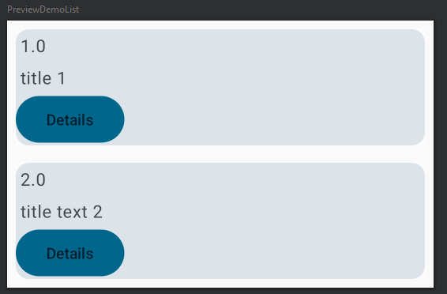
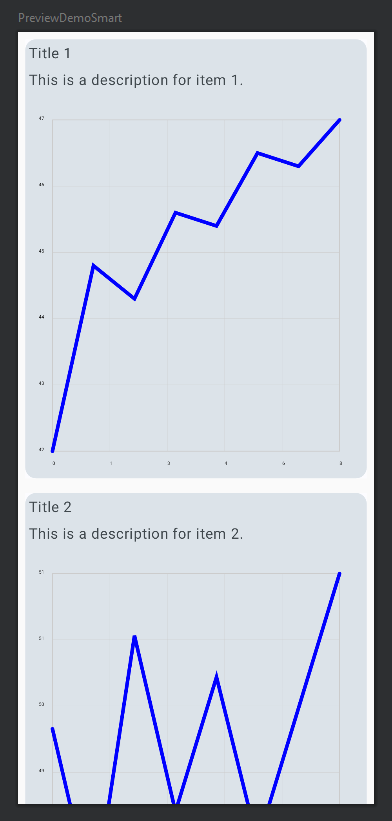
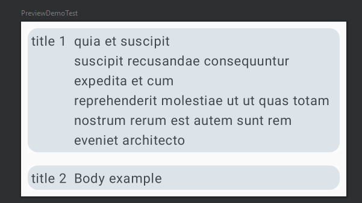
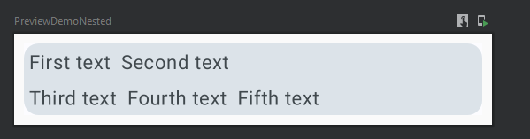
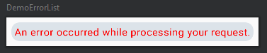

# SmartView

## Overview
This repository demonstrates how to interpret a JSON template in order to dynamically create views with data in Jetpack Compose. It supports a variety of components including text, button, line chart, scatter plot, table, and nested rows and columns.

## Features
- Interprets JSON templates and data to generate dynamic views in Jetpack Compose.
- Supports multiple types of components including text, button, line chart, scatter plot, and table.
- Supports nesting of rows and columns in the JSON template.
- Error handling to display error messages in case of failure in view generation.
  
## Usage
To use this project, you need to provide a JSON template that defines the structure of the view you want to generate, and JSON data that provides the content for these views.

Here's an example of a simple list
Template:
```json
{
  "type": "list",
  "dataTemplate": {
    "elements": [
      {
        "type": "text",
        "mapTo": "id"
      },
      {
        "type": "text",
        "mapTo": "title"
      },
      {
        "type": "button",
        "mapTo": "body",
        "attributes": {
          "text": "Details"
        }
      }
    ]
  }
}
```

Data:
```json
[
  {
    "userId": 1,
    "id": 1,
    "title": "title 1",
    "body": "quia et suscipit\nsuscipit recusandae consequuntur expedita et cum\nreprehenderit molestiae ut ut quas totam\nnostrum rerum est autem sunt rem eveniet architecto"
  },
  {
    "userId": 2,
    "id": 2,
    "title": "title text 2",
    "body": "Body example"
  }
]

```
UI:



Graphing Example
Template:
```json
{
  "type": "list",
  "dataTemplate": {
    "elements": [
      {
        "type": "text",
        "mapTo": "title"
      },
      {
        "type": "text",
        "mapTo": "description"
      },
      {
        "type": "lineChart",
        "mapTo": "dataPoints"
      }
    ]
  }
}
```
Data:
```json
[
  {
    "title": "Title 1",
    "description": "This is a description for item 1.",
    "dataPoints": [42.5, 45.3, 44.8, 46.1, 45.9, 47.0, 46.8, 47.5]
  },
  {
    "title": "Title 2",
    "description": "This is a description for item 2.",
    "dataPoints": [50.3, 48.6, 51.2, 49.5, 50.8, 49.2, 50.5, 51.8]
  },
  {
    "title": "Title 3",
    "description": "This is a description for item 3.",
    "dataPoints": [40.1, 39.5, 41.2, 40.6, 39.9, 41.6, 40.0, 42.7]
  }
]
```
UI:



Other UI Examples:







## Setup
Clone the repository.
Open the project in Android Studio.
Run the project on an emulator or physical device.

## License

This project is licensed under the MIT License - see the [LICENSE.md](LICENSE.md) file for details
